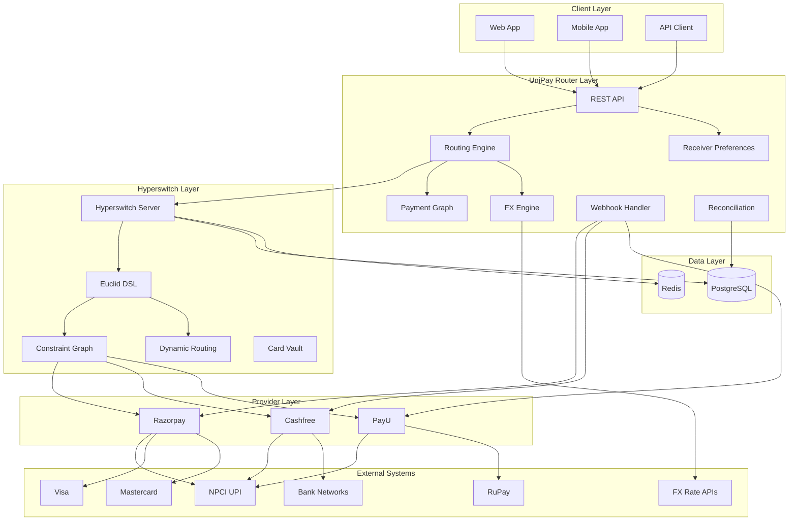
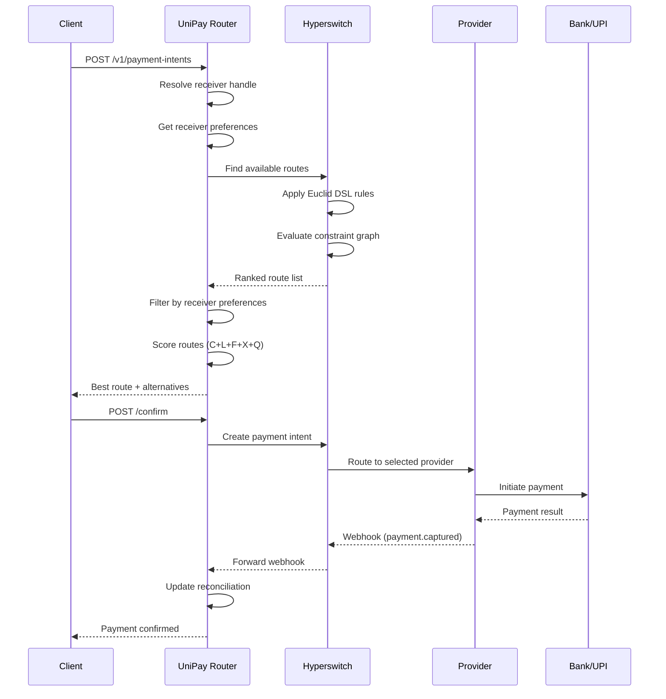
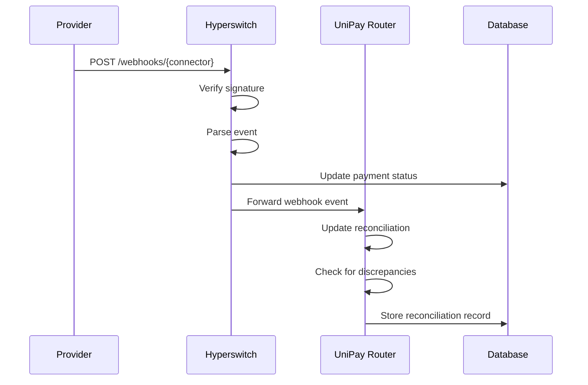
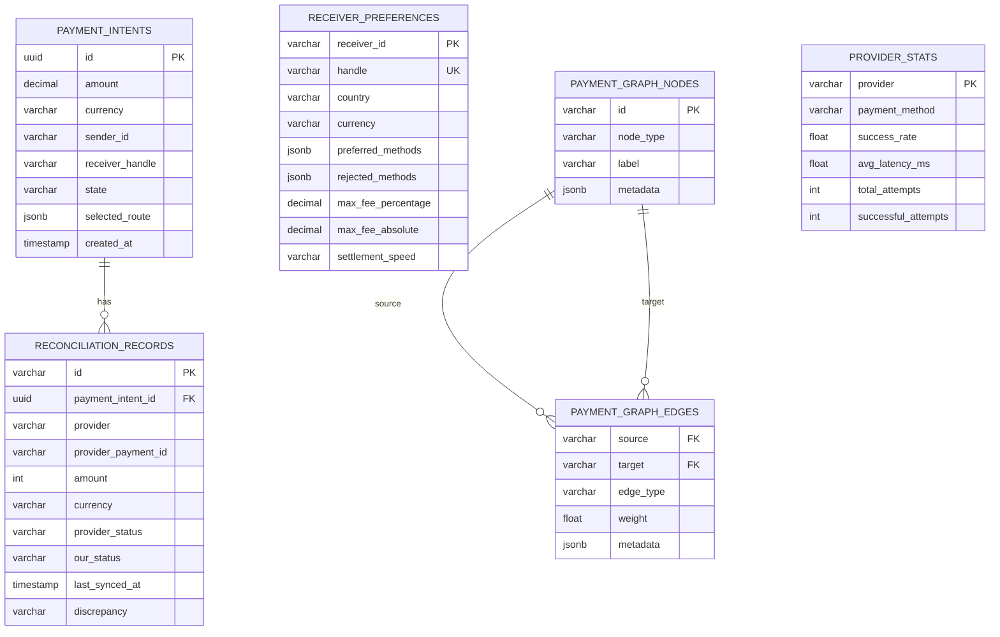
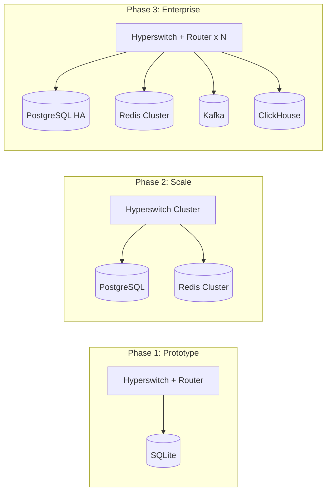

# Architecture

## System Overview

## Data Flow

### Payment Flow

### Webhook Flow

## Database Schema

## Component Descriptions

### Routing Engine
The core decision-maker. Uses Hyperswitch's Euclid DSL for constraint-based routing, extended with our receiver preference filtering and scoring function.

### Receiver Preferences
The novel layer. Stores how each receiver wants to get paid (methods, fees, speed, currency) and filters routes accordingly.

### Payment Graph
A graph model where nodes are providers, rails, countries, currencies, receivers, and merchants. Edges represent "money can move from A to B under these conditions." Grows with every receiver added.

### FX Engine
Fetches live exchange rates from free APIs (exchangerate-api.com, CurrencyScoop) with caching and fallback to hardcoded rates.

### Webhook Handler
Normalizes incoming webhooks from Razorpay, Cashfree, and PayU into a unified event format. Handles signature verification.

### Reconciliation Engine
Tracks transaction states across all providers, identifies discrepancies, and provides a unified view. This is the "boring" moat that becomes valuable at scale.

## Scalability

