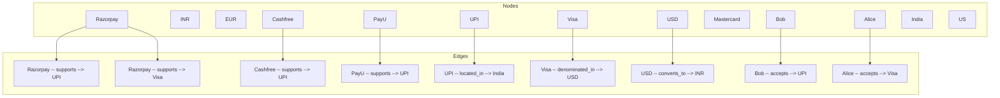
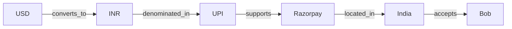
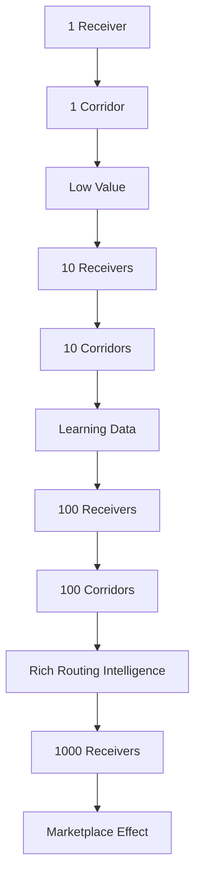

# Payment Graph

## Concept

A payment graph models the flow of money as a network:



## Node Types

| Type | Examples | Count |
|------|----------|-------|
| Currency | INR, USD, EUR, GBP, SGD, AED | 6+ |
| Provider | Razorpay, Cashfree, PayU | 3+ |
| Payment Method | UPI, Visa, Mastercard, RuPay, Net Banking | 5+ |
| Country | India, US, UK, UAE | 4+ |
| Receiver | @bob, @alice, @merchant1 | Dynamic |
| Merchant | Store1, Store2 | Dynamic |

## Edge Types

| Edge | From | To | Meaning |
|------|------|----|---------|
| supports | Provider | Method | Provider can process this method |
| located_in | Method | Country | Method works in this country |
| denominated_in | Method | Currency | Method operates in this currency |
| converts_to | Currency | Currency | FX conversion possible |
| accepts | Receiver | Method | Receiver accepts this method |

## Corridor: The Key Path

A corridor is the complete path money can take:

```
USD -> Visa -> Razorpay -> INR -> UPI -> Bob
```



## Network Effects



## Graph Statistics

The graph grows with every new receiver:

| Receivers | Providers | Corridors | Routing Intelligence |
|-----------|-----------|-----------|---------------------|
| 1 | 3 | 3 | Minimal |
| 10 | 3 | 30 | Learning |
| 100 | 3 | 300 | Rich |
| 1000 | 3 | 3000 | Marketplace |

## Future: Payment Graph Network

As more merchants and receivers join, the graph becomes more valuable. The flywheel:

1. More receivers → more corridors
2. More corridors → more payment data
3. More data → better routing decisions
4. Better decisions → lower costs
5. Lower costs → more receivers join

**This is the network effect that makes the payment graph defensible.**
