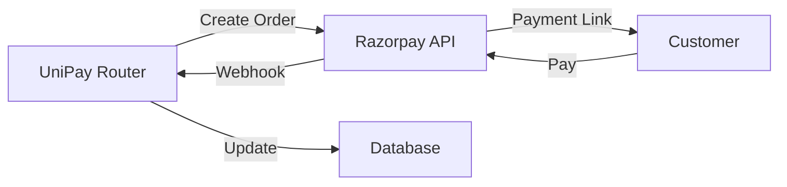
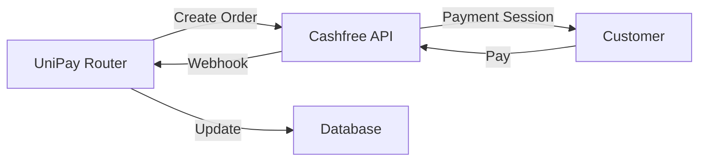
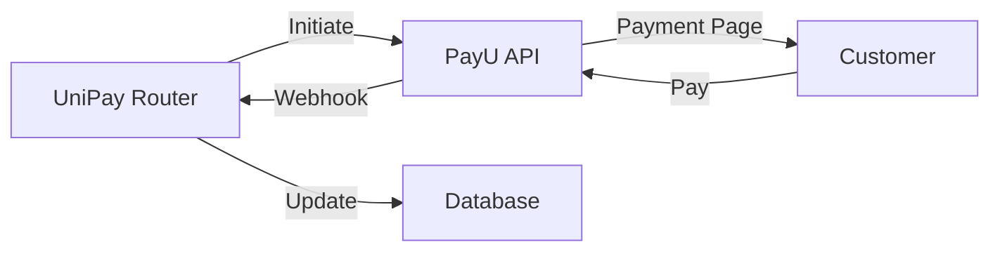
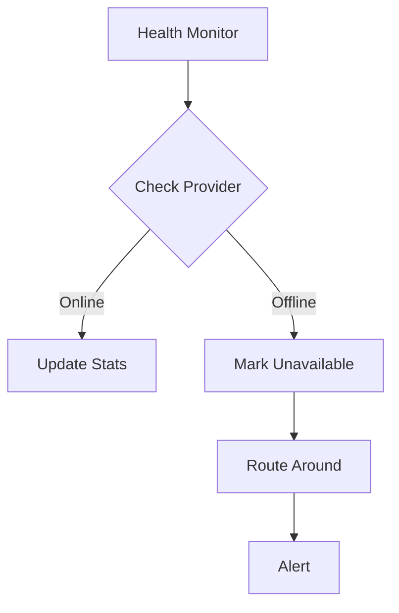

# Provider Integration

## Sandbox Setup

All providers offer free test/sandbox environments.

---

### Razorpay

**Test API Key:** `rzp_test_...` (create at [dashboard.razorpay.com](https://dashboard.razorpay.com))

**Test UPI IDs:**
- `success@razorpay` — Always succeeds
- `failure@razorpay` — Always fails

**Test Cards:**
| Card Number | Expiry | CVV | Result |
|-------------|--------|-----|--------|
| 4111 1111 1111 1111 | Any future | Any | Success |
| 5104 0600 0000 0008 | Any future | Any | Success |
| 4000 0000 0000 0002 | Any future | Any | Failure |

**Webhook URL:** `POST http://localhost:3000/v1/webhooks/razorpay`

**Events:** `payment.captured`, `payment.failed`, `refund.created`



---

### Cashfree

**Test App ID:** `test_app_...` (create at [cashfree.com/dev](https://cashfree.com/dev))

**Test UPI IDs:**
- `success@cashfree` — Always succeeds
- `testing@cashfree` — Test mode

**Test Cards:**
| Card Number | Expiry | CVV | Result |
|-------------|--------|-----|--------|
| 4111 1111 1111 1111 | Any future | Any | Success |
| 5104 0600 0000 0008 | Any future | Any | Success |

**Webhook URL:** `POST http://localhost:3000/v1/webhooks/cashfree`

**Events:** `PAYMENT_SUCCESS`, `PAYMENT_FAILED`, `REFUND_CREATED`



---

### PayU

**Test Merchant Key:** `...` (create at [payu.in](https://payu.in))

**Test UPI IDs:**
- `success@payu` — Always succeeds
- `failure@payu` — Always fails

**Test Cards:**
| Card Number | Expiry | CVV | Result |
|-------------|--------|-----|--------|
| 4012 0010 3749 1132 | Any future | Any | Success |
| 5123 4567 8901 2346 | Any future | Any | Success |

**Webhook URL:** `POST http://localhost:3000/v1/webhooks/payu`

**Events:** `payment_success`, `payment_failed`, `refund_processed`



---

## Connector Configuration

The Hyperswitch connector configuration is in `config/hyperswitch.toml`:

```toml
[connectors.razorpay]
connector_type = "payment_processor"
processor_id = "razorpay"
api_key = "rzp_test_xxxxx"
api_secret = "xxxxx"

[connectors.cashfree]
connector_type = "payment_processor"
processor_id = "cashfree"
app_id = "test_app_xxxxx"
api_secret = "xxxxx"
```

## Switching Providers

The routing engine automatically selects the best provider. Manual override:

```json
{
  "amount": 10000,
  "currency": "INR",
  "receiver_handle": "bob@unipay",
  "force_provider": "cashfree"
}
```

## Adding New Providers

1. Add connector config to `config/hyperswitch.toml`
2. Update `unipay_router/providers.py`
3. Add webhook handler in `unipay_router/webhook_handler.py`
4. Test with sandbox credentials

## Provider Health Monitoring


