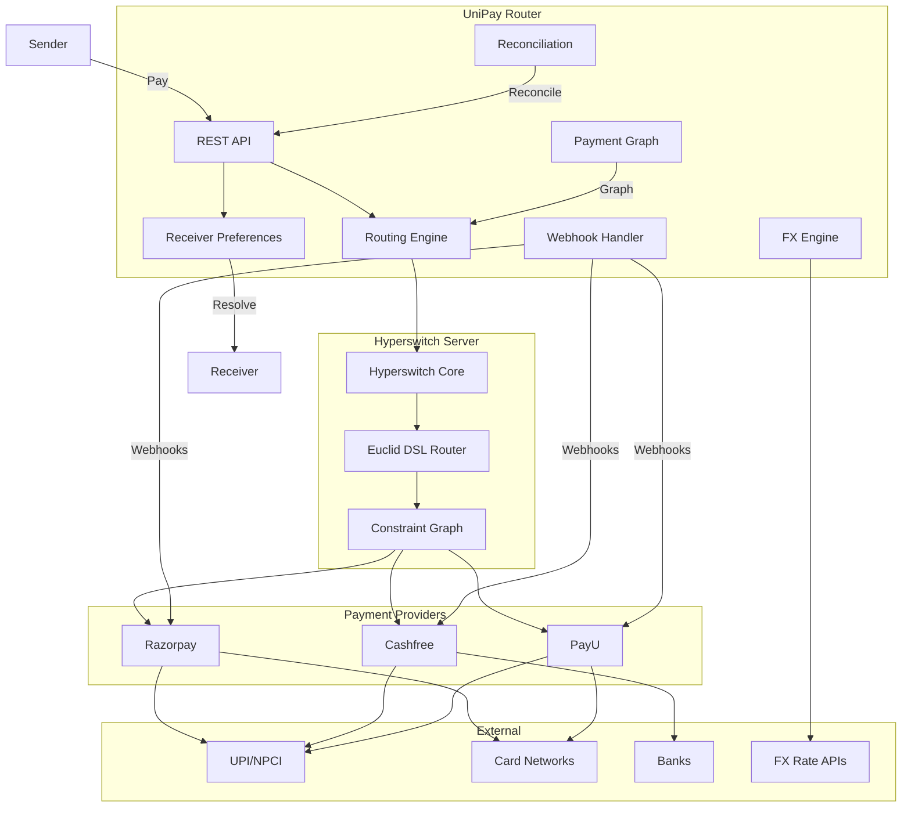
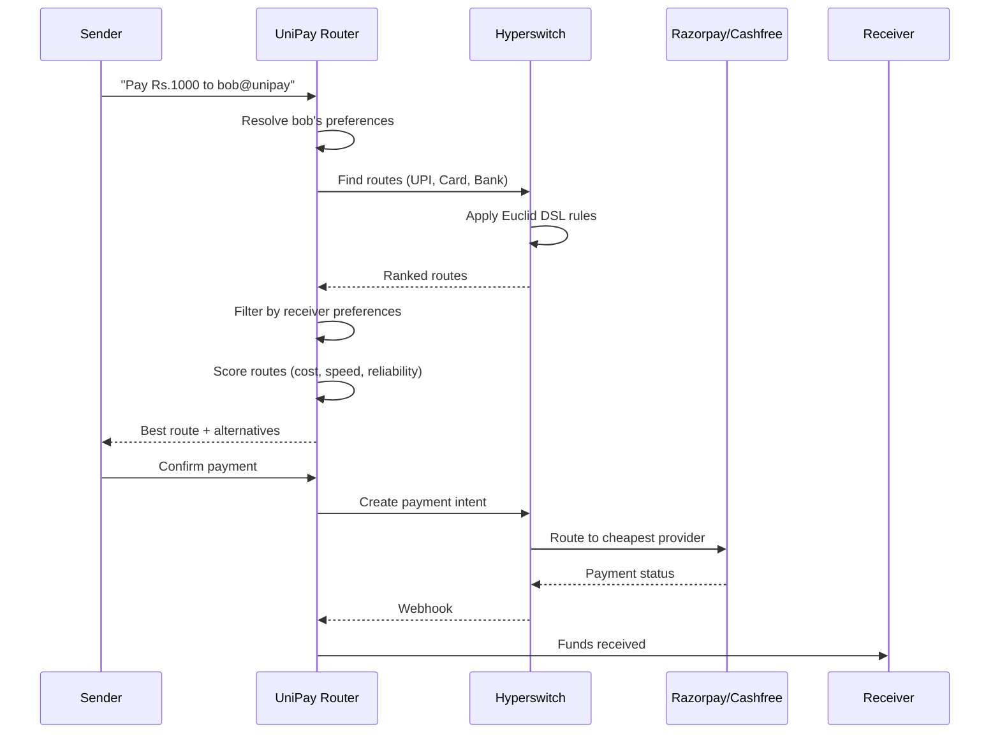

# Universal Payment Router

**Sender pays how they want. Receiver receives how they want.**

[](LICENSE)
[](https://www.python.org/)
[](https://github.com/juspay/hyperswitch)

## Architecture



## How It Works



## Quick Start

```bash
# Clone the repo
git clone https://github.com/your-org/unipay-router.git
cd unipay-router

# Start with Docker Compose (or run `python -m unipay_router.server`)
docker compose up --build

# Register a receiver
curl -X POST http://localhost:3000/v1/receiver-preferences \
  -H "Content-Type: application/json" \
  -d '{"receiver_id":"bob","handle":"bob@unipay","preferred_methods":["upi"]}'

# Create a payment intent
curl -X POST http://localhost:3000/v1/payment-intents \
  -H "Content-Type: application/json" \
  -d '{
    "amount": 10000,
    "currency": "INR",
    "receiver_handle": "bob@unipay",
    "sender": {
      "country": "IN",
      "preferred_methods": ["upi", "card"]
    }
  }'
```

### Zero-cost local MVP

The router runs without Hyperswitch, a database, provider credentials, or paid
APIs. It uses deterministic in-memory provider profiles for route selection,
which is suitable for local development and demos. Python 3.10+ is the only
runtime requirement:

```shell
python -m venv .venv
. .venv/bin/activate
pip install -e .
python -m unipay_router.server
```

In a second terminal, register a receiver and request a route:

```shell
curl -X POST http://localhost:3000/v1/receiver-preferences \
  -H 'Content-Type: application/json' \
  -d '{"receiver_id":"bob","handle":"bob@unipay","preferred_methods":["upi"]}'

curl -X POST http://localhost:3000/v1/payment-intents \
  -H 'Content-Type: application/json' \
  -d '{"amount":1000,"currency":"INR","receiver_handle":"bob@unipay","sender":{"preferred_methods":["upi"]}}'
```

Docker is optional and uses the included local-only Compose file:

```shell
docker compose up --build
```

This MVP does not move real money. Real payment acceptance requires regulated
provider accounts, credentials, webhook verification, durable storage, and a
security/compliance review before production use.

## Features

- **Universal Routing**: UPI, Cards, Net Banking, Wallets, PayPal, Bank Transfer
- **Receiver Preferences**: Receivers define how they want to get paid
- **Intelligent Scoring**: `R* = argmin(C + L + F + X + Q)` — cost, latency, failure risk, FX, compliance
- **Failure Recovery**: Automatic retry with alternative providers
- **Payment Graph**: Grows with every receiver, creating network effects
- **Cross-Border**: USD/EUR/GBP/SGD/AED to INR with live FX rates
- **Reconciliation**: Unified view across all providers (the "boring" moat)
- **Built on Hyperswitch**: 43k+ stars, 120+ connectors, production-tested

## Provider Support

| Provider | UPI | Cards | Net Banking | Wallet | Status |
|----------|-----|-------|-------------|--------|--------|
| Razorpay | ✅ | ✅ | ✅ | ✅ | Sandbox Ready |
| Cashfree | ✅ | ✅ | ✅ | ✅ | Sandbox Ready |
| PayU | ✅ | ✅ | ✅ | ✅ | Sandbox Ready |

## Comparison: UniPay Router vs Hyperswitch Alone

| Feature | Hyperswitch | UniPay Router |
|---------|-------------|---------------|
| Routing | Merchant-centric | Receiver-centric |
| Identity | API keys per merchant | Universal `@handle` identity |
| Preferences | Merchant defines rules | Receiver defines constraints |
| Payment graph | None | Grows with every receiver |
| Cross-border | Provider-specific | Intelligent FX routing |

## Documentation

- [Architecture](ARCHITECTURE.md) — System design and data flow
- [API Reference](API.md) — Full REST API documentation
- [Routing Algorithm](ROUTING.md) — Scoring function and constraint graph
- [Provider Integration](PROVIDERS.md) — Sandbox setup for each provider
- [Receiver Preferences](RECEIVER-PREFERENCES.md) — Preference system design
- [Payment Graph](PAYMENT-GRAPH.md) — Graph model and network effects
- [Deployment](DEPLOYMENT.md) — Docker, cloud, local setup
- [Security](SECURITY.md) — PCI compliance, API key handling
- [Contributing](CONTRIBUTING.md) — Development setup and guidelines

## License

Apache License 2.0 — see [LICENSE](LICENSE) for details.

Built on [Hyperswitch](https://github.com/juspay/hyperswitch) (Apache 2.0).
