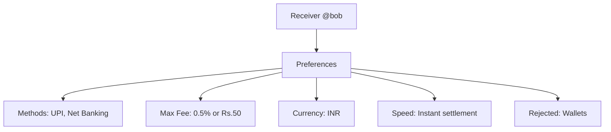
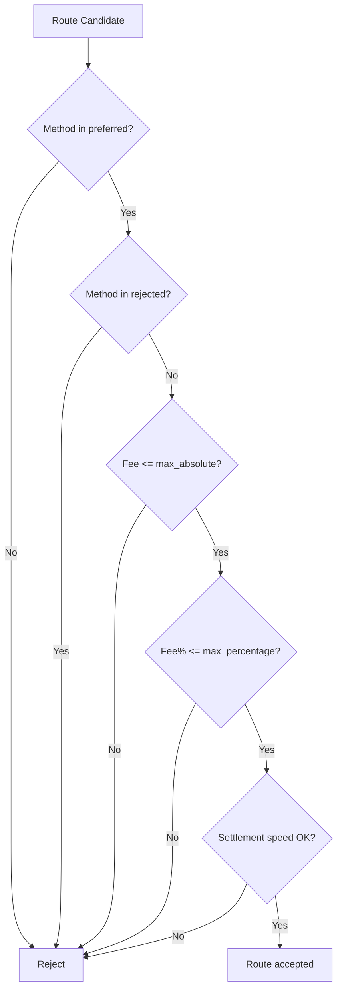
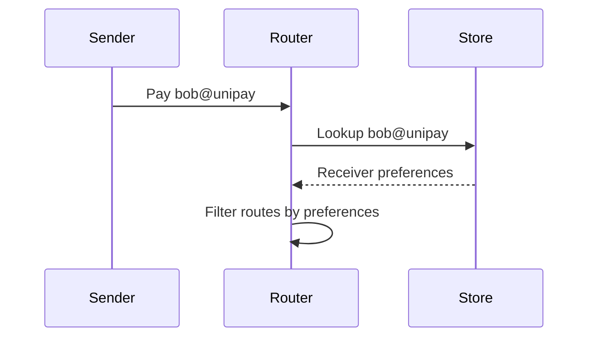

# Receiver Preferences

## Overview

Receiver preferences are the core differentiator. Every receiver defines how they want to get paid.



## Preference Schema

```json
{
  "receiver_id": "bob",
  "handle": "bob@unipay",
  "country": "IN",
  "currency": "INR",
  "preferred_methods": ["upi", "net_banking"],
  "rejected_methods": ["wallet"],
  "max_fee_percentage": 0.5,
  "max_fee_absolute": 50.0,
  "settlement_speed": "instant"
}
```

## Filtering Logic



## Handle Resolution



## Multi-Currency Receivers

A receiver can accept multiple currencies:

```json
{
  "receiver_id": "alice",
  "handle": "alice@unipay",
  "country": "IN",
  "currency": "INR",
  "preferred_methods": ["upi", "visa", "mastercard"],
  "accepted_currencies": ["INR", "USD", "EUR"],
  "max_fee_percentage": 1.0,
  "settlement_speed": "t+1"
}
```

## Privacy Levels

| Level | Description |
|-------|-------------|
| Public | Handle visible to all, preferences public |
| Registered | Handle must be known, preferences private |
| Private | No public handle, direct API only |
