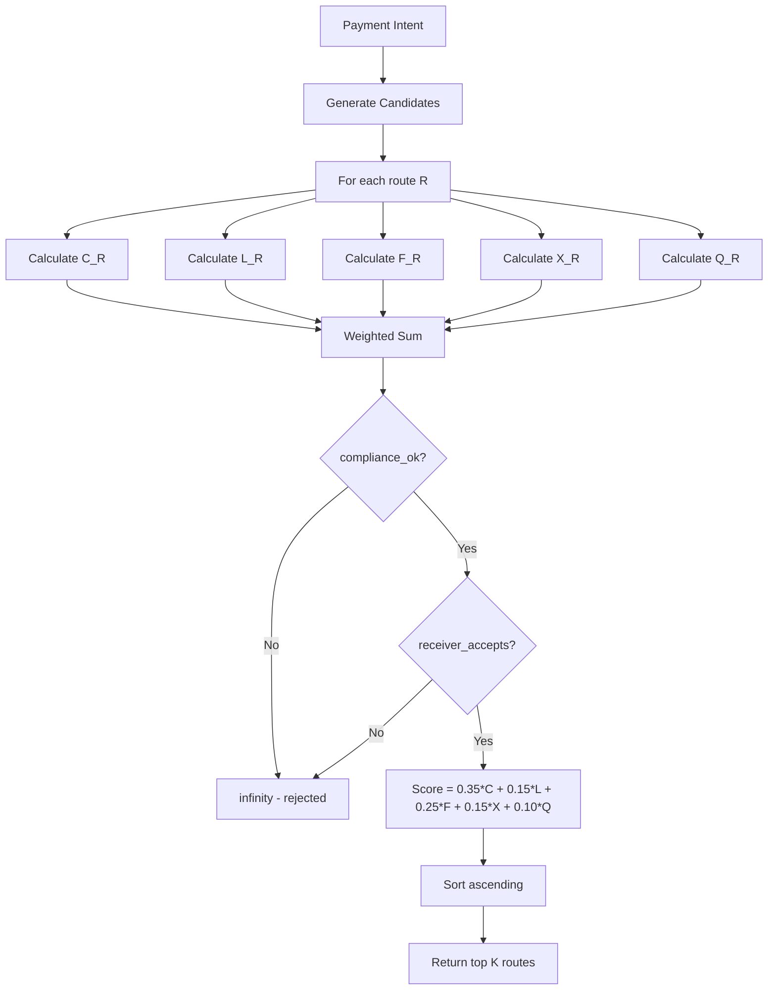
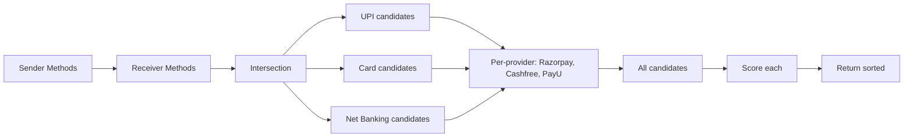
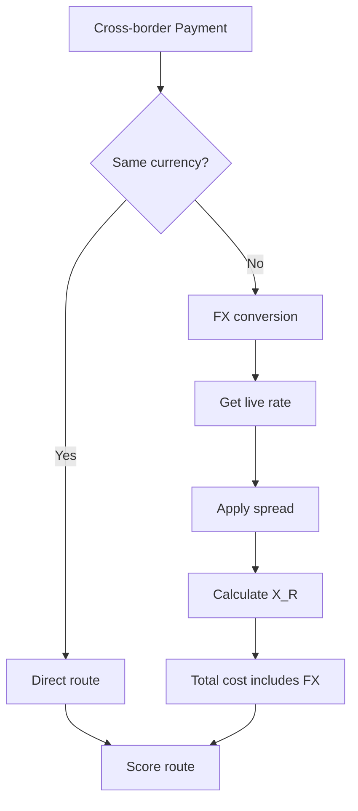
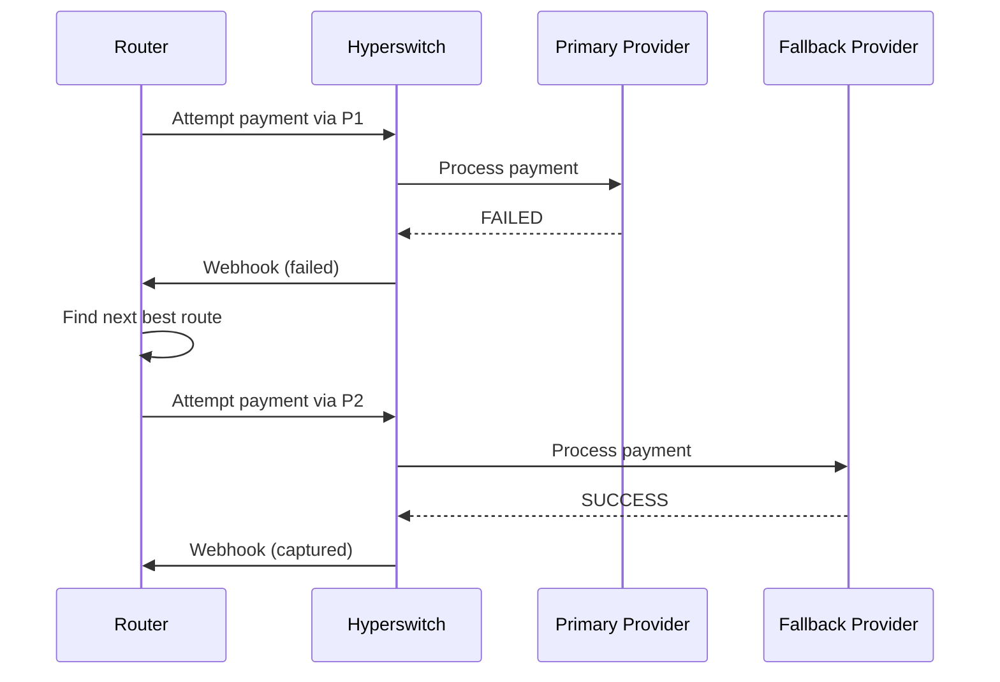

# Routing Algorithm

## The Scoring Function

The core routing optimization is:

```
R* = argmin_R (C_R + L_R + F_R + X_R + Q_R)
```

Where each component is normalized to 0-1 scale:

| Weight | Component | Description |
|--------|-----------|-------------|
| 0.35 | C_R | Cost: (fee + fx_cost) / amount |
| 0.15 | L_R | Latency: min(latency_ms / 5000, 1) |
| 0.25 | F_R | Failure risk: 1 - success_probability |
| 0.15 | X_R | FX cost: fx_cost / amount |
| 0.10 | Q_R | Compliance/risk penalty: 0-1 risk score |

**Lower score = better route.**



## Candidate Generation



## Constraint Filtering

Before scoring, candidates are filtered:

```python
# Receiver preference filtering
if route.payment_method not in receiver.preferred_methods:
    route.receiver_accepts = False

if route.payment_method in receiver.rejected_methods:
    route.receiver_accepts = False

if route.fee > receiver.max_fee_absolute:
    route.receiver_accepts = False

if (route.fee / route.amount) > (receiver.max_fee_percentage / 100):
    route.receiver_accepts = False
```

## Cross-Border Routing



## Failure Recovery



## Route Selection Priority

1. **Receiver constraints** (hard filter) — methods, fees, speed
2. **Compliance** (hard filter) — country regulations, risk
3. **Failure risk** (high weight) — success rate is king
4. **Cost** (high weight) — total fee + FX
5. **Latency** (lower weight) — speed matters but not at any cost
