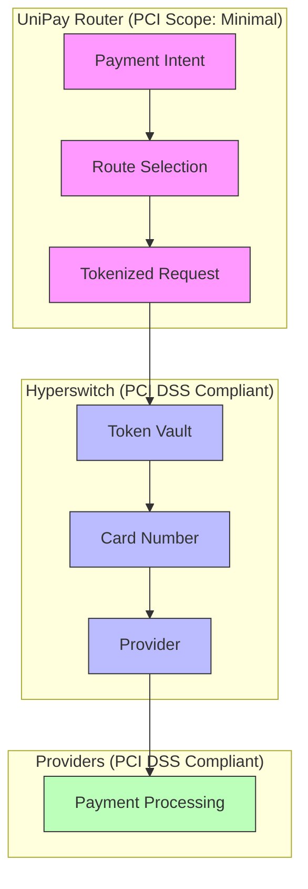
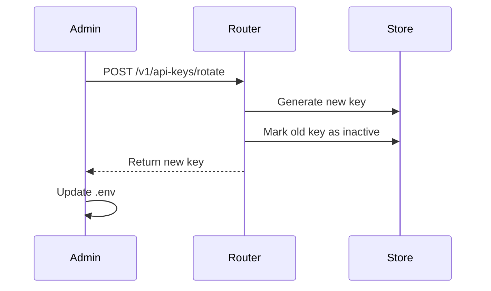
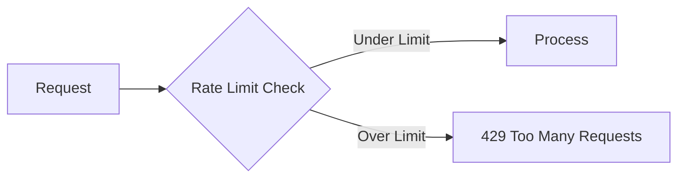
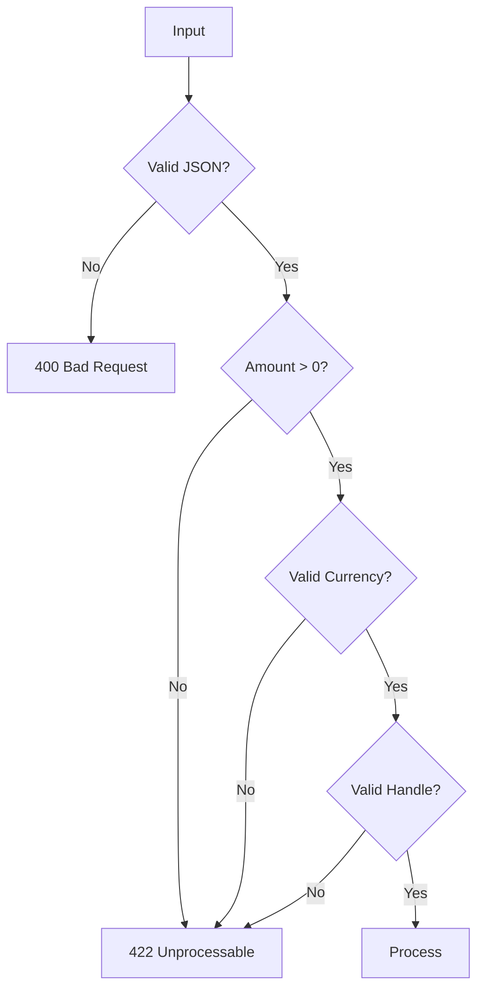
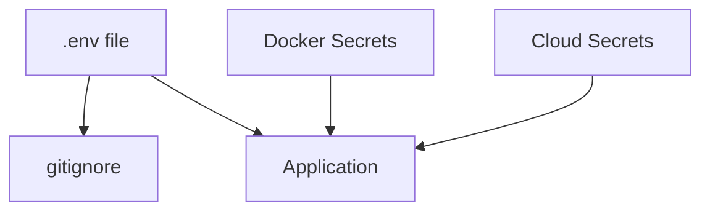

# Security

## PCI DSS Compliance

UniPay Router does **NOT** store card numbers, CVVs, or other sensitive card data.



**Card data never touches our servers.** It goes directly from the customer to Hyperswitch (which has a PCI DSS compliant vault) to the provider.

## API Key Authentication

```bash
# All API requests require X-API-Key header
curl -H "X-API-Key: your-api-key-here" \
     http://localhost:3000/v1/payment-intents
```

### Key Rotation



## Webhook Signature Verification

All incoming webhooks are verified:

```python
# Razorpay
expected = hmac.new(webhook_secret, payload, sha256).hexdigest()
actual = headers.get("X-Razorpay-Signature")
assert expected == actual

# Cashfree
expected = sha256(app_id + secret + payload).hexdigest()
actual = headers.get("X-Cashfree-Signature")
assert expected == actual
```

## Rate Limiting



| Endpoint | Limit |
|----------|-------|
| Payment Intents | 100/min |
| Webhooks | 1000/min |
| Resolve | 1000/min |
| Graph Stats | 100/min |

## Input Validation



## Secrets Management

**Never commit secrets to git.** Use:

- `.env` files (gitignored)
- Docker secrets
- Cloud secrets managers (AWS Secrets Manager, etc.)



## Audit Logging

```json
{
  "timestamp": "2026-09-15T10:30:00Z",
  "event": "payment.created",
  "user_id": "sender_123",
  "payment_id": "pi_a1b2c3d4",
  "amount": 10000,
  "currency": "INR",
  "receiver": "bob@unipay",
  "route": "upi/razorpay",
  "ip": "192.168.1.100"
}
```

## Security Checklist

- [ ] API keys are strong (32+ characters)
- [ ] HTTPS enabled in production
- [ ] Webhook signatures verified
- [ ] Rate limiting configured
- [ ] Input validation enabled
- [ ] Secrets not in git
- [ ] Audit logging enabled
- [ ] Regular key rotation

## Responsible Disclosure

If you find a security vulnerability, please email security@unipay-router.dev (or open a private issue).
